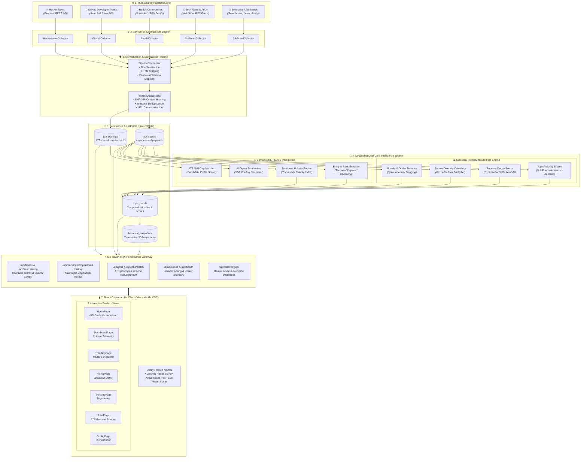

# WebPulse AI: Real-Time Web Trend & Intelligence Tracker
> **Autonomous Community Intelligence & Opportunity Radar**: Multi-source web scraping, statistical topic velocity tracking, AI sentiment & categorization, and ATS resume skill-gap matching.

[](https://frontend-woad-one-33.vercel.app)
[](https://github.com/srinathdoggala-tech/WebPulse-AI)

🌐 **Live Production App**: [https://frontend-woad-one-33.vercel.app](https://frontend-woad-one-33.vercel.app)

---

## 🌟 Overview & Emergent Demonstration Signals

**WebPulse AI** is a full-stack, production-grade intelligence platform engineered to track, analyze, and synthesize emerging technology shifts and job opportunities across the developer ecosystem.

Rather than relying on opaque LLM predictions to guess "what is trending", WebPulse AI strictly decouples **understanding** from **measurement**:
- **LLM / NLP Layer → Understanding**: Extracts semantic topics, normalized taxonomy categories, sentiment polarity, and market opportunity signals.
- **Statistical Engine → Trend Measurement**: Computes rigorous quantitative trend scores using actual volume, exponential recency half-life, cross-source diversity multipliers, and historical velocity.

| Emergent Signal | Implementation in WebPulse AI |
| :--- | :--- |
| **Python Scraper & Collectors** | Multi-source asynchronous collectors for **Hacker News (Firebase API)**, **GitHub (Search API)**, **Reddit (JSON feeds)**, **ArXiv / Tech News (RSS)**, and **ATS Job Boards (Greenhouse/Lever/Ashby)**. |
| **Tracker & Historical State** | Topic velocity calculus (`% 24h acceleration`), breakout novelty detection, historical database snapshots, and SQLite persistence. |
| **Real-World Data Ingestion** | Robust normalization pipeline with title sanitization, HTML stripping, category classification, and SHA-256 content deduplication. |
| **AI & NLP Analysis** | Technical entity clustering, sentiment polarity scoring, dynamic trend scoring algorithm (`(engagement * recency) * source_diversity`), and executive AI intelligence digest. |
| **Job & Opportunity Intelligence** | Automated ATS job parser, candidate skill extractor, weighted match scorer, and interactive skill-gap analysis (missing skills highlight). |
| **Full-Stack & APIs** | FastAPI backend with modular REST routers (`/api/trends`, `/api/feed`, `/api/jobs`, `/api/stats`, `/api/summary`, `/api/collect`) + React frontend with glassmorphism, responsive grid, and live collector triggers. |

---

## 🏛️ System Architecture



### 🔄 End-to-End Dataflow Lifecycle

```
[External Web APIs]
       │
       ▼ (Asynchronous Collectors)
[Ingestion Normalizer & SHA-256 Deduplication]
       │
       ▼ (Raw Signal Ingestion)
[Persistence Layer (SQLite DB)]
       │
       ├──► [Statistical Velocity Engine]  ──────► (Computes Volume, Recency Decay, Cross-Source Multiplier)
       │                                                                  │
       └──► [Semantic NLP / ATS Analyzer]  ──────► (Extracts Entities, Sentiment Polarity, Skill Profiles)
                                                                          │
                                                                          ▼
                                                       [Consolidated Trend Matrix]
                                                                          │
                                                                          ▼
                                                       [FastAPI High-Speed REST API]
                                                                          │
                                                                          ▼
                                            [Vite React Glassmorphic Client (7 Surfaces)]
```


---

## 📁 Repository Structure

```
TrendRadar-AI/
├── backend/
│   ├── app/
│   │   ├── collectors/        # Scrapers for HN, GitHub, Reddit, RSS, Jobs
│   │   │   ├── base.py
│   │   │   ├── hackernews.py
│   │   │   ├── github.py
│   │   │   ├── reddit.py
│   │   │   ├── rss_news.py
│   │   │   └── jobs.py
│   │   ├── pipeline/          # Normalization & deduplication
│   │   │   ├── normalizer.py
│   │   │   └── deduplicator.py
│   │   ├── ai/                # Topic clustering, sentiment, velocity scoring
│   │   │   ├── topic_extractor.py
│   │   │   ├── sentiment.py
│   │   │   ├── trend_scorer.py
│   │   │   └── summarizer.py
│   │   ├── tracking/          # Job matcher, resume gap analysis, history
│   │   │   ├── job_matcher.py
│   │   │   └── velocity.py
│   │   ├── routes/            # REST API endpoints
│   │   │   ├── trends.py
│   │   │   ├── feed.py
│   │   │   ├── jobs.py
│   │   │   ├── stats.py
│   │   │   ├── summary.py
│   │   │   └── collect.py
│   │   ├── models/            # Pydantic schemas
│   │   │   └── schema.py
│   │   ├── config.py          # App settings & CORS
│   │   ├── database.py        # SQLite initialization & demo seeding
│   │   └── main.py            # FastAPI entry point
│   ├── tests/                 # Pytest test suite
│   │   ├── test_normalizer.py
│   │   └── test_job_matcher.py
│   ├── requirements.txt
│   ├── run.py                 # Uvicorn server runner
│   └── pytest.ini
│
├── frontend/
│   ├── src/
│   │   ├── pages/
│   │   │   ├── HomePage.tsx         # Launchpad, KPI stats cards, architectural pillars
│   │   │   ├── DashboardPage.tsx    # Telemetry stat cards, volume & category Recharts
│   │   │   ├── TrendingPage.tsx     # Trending radar, search filters, interactive topic inspector
│   │   │   ├── RisingPage.tsx       # Breakout acceleration (>120% velocity) & window selector
│   │   │   ├── TrackingPage.tsx     # Comparative trajectory line graphs & novelty classifier
│   │   │   ├── JobsPage.tsx         # ATS job openings & candidate resume skill gap scanner
│   │   │   └── ConfigPage.tsx       # Scraper frequency controls & collector orchestration
│   │   ├── App.tsx                  # Sticky frosted navbar, route management & pulse badge
│   │   ├── index.css                # Zero-dependency Vanilla CSS Glassmorphic Design System
│   │   └── main.tsx                 # React DOM client entry point
│   ├── index.html
│   ├── package.json
│   ├── tsconfig.json
│   └── vite.config.ts
│
└── README.md

```

---

## 🚀 Quick Start Guide

### 1. Backend Setup (FastAPI)

```bash
cd backend
python -m venv venv
# Windows:
.\venv\Scripts\activate
# Linux/macOS:
source venv/bin/activate

pip install -r requirements.txt
python run.py
```
> The API will be live at `http://localhost:8000` with interactive Swagger docs at `http://localhost:8000/docs`.

### 2. Frontend Setup (React + Vite)

```bash
cd frontend
npm install
npm run dev
```
> Open your browser to `http://localhost:5173` to explore the TrendRadar interface.

### 3. Running Unit Tests

```bash
cd backend
pytest
```

---

## 🎯 Key Capabilities & Screen Highlights

1. **Live Trend Radar**:
   - Cross-source radar score (`0-100`) computed via engagement intensity, recency half-life, and platform diversity multiplier.
   - Filter by tech sectors: `AI & Agents`, `LLMs & Architecture`, `AI Infrastructure`, `Developer Tools`, `Web Development`.
   - Click any card for a deep-dive modal revealing linked discussions and original sources.

2. **Velocity Spikes & Novelty Detection**:
   - Isolates breakthrough topics surging above `+120% 24h velocity` (e.g., Model Context Protocol MCP, Test-Time Compute, DeepSeek MoE).

3. **Interactive ATS Job & Skill Gap Matcher**:
   - Paste candidate resume text or click instant presets (*Full-Stack AI*, *CUDA/Inference*, *Rust/Go Systems*).
   - Generates match score %, matched skills (green badges), missing skills (red badges), and tailored recommendation for high-paying roles.

4. **Multi-Source Unified Feed**:
   - Filter by source (*HackerNews*, *GitHub*, *Reddit*, *ArXiv/TechNews*), live search keywords, view upvotes and community responses.

5. **AI Intelligence Digest**:
   - Consolidated executive brief synthesizing narrative shifts, emerging tooling, and enterprise hiring demands.
